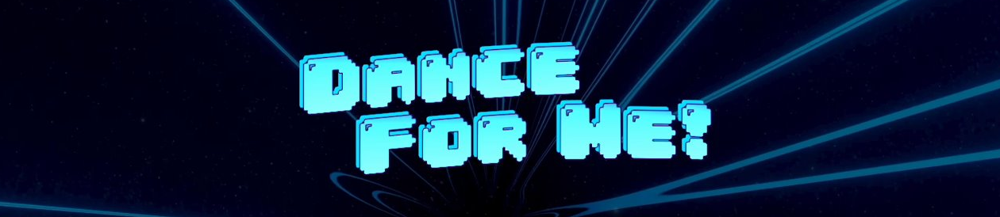
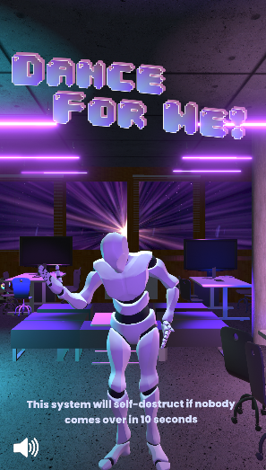
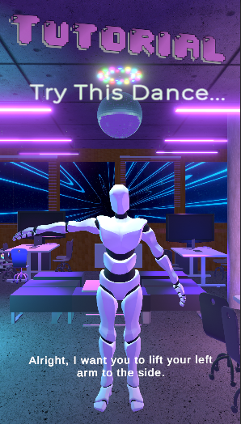
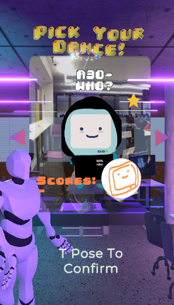
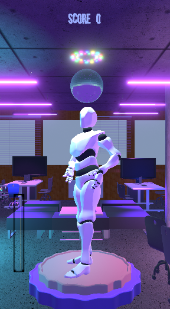
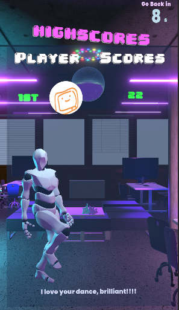

<!-- Improved compatibility of back to top link: See: https://github.com/othneildrew/Best-README-Template/pull/73 -->
<a name="readme-top"></a>
<!--
*** Thanks for checking out the Best-README-Template. If you have a suggestion
*** that would make this better, please fork the repo and create a pull request
*** or simply open an issue with the tag "enhancement".
*** Don't forget to give the project a star!
*** Thanks again! Now go create something AMAZING! :D
-->


<!-- PROJECT LOGO -->

<br />

<div align="center">
  <h1 align="center">Dance for Me! </h1>
    
  
  <p align="center">
    Let's Dance together!
  </p>
</div>


<!-- TABLE OF CONTENTS -->
<details>
  <summary>Table of Contents</summary>
  <ol>
    <li>
      <a href="#about-the-project">About The Project</a>
      <ul>
        <li><a href="#built-with">Built With</a></li>
      </ul>
    </li>
    <li>
      <a href="#getting-started">Getting Started</a>
      <ul>
        <li><a href="#prerequisites">Prerequisites</a></li>
        <li><a href="#installation">Installation</a></li>
      </ul>
    </li>
    <li><a href="#usage">Usage</a></li>
    <li><a href="#contributing">Contributing</a></li>
    <li><a href="#contact">Contact</a></li>
    <li><a href="#acknowledgments">Acknowledgments</a></li>
  </ol>
</details>


<!-- ABOUT THE PROJECT -->
## About The Project
<div style="display:flex; justify-content:center;">
  
  
  
  
  
</div>

Dance for Me is an interactive AR experience in which players mimic a variety of dances performed by 3D model animations with real time feedback. The motivation behind this project lies in encouraging desk-bound computer scientists to get up and dance. Dance for Me was built to interact with users and embodies serendipitous exertion to encourage participants to engage. This gives our avatar ‘Delboi’ a human like feel which is an objective that we strived to achieve. 


With aims to ...
* Create an engaging and immersive dancing system for users in computer science building e.g. waving and dancing to users to join dancing together by the mascot, give feedback when playing by voice lines or subtitles  
* Create a system for tracking and scoring players’ dance moves  
* Create an aesthetic system e.g. designing the avatar and the colour theme  


<p align="right">(<a href="#readme-top">back to top</a>)</p>


### Built With
 

*  Python 3.8
*  Unity
*  C#
* MediaPipe

<p align="right">(<a href="#readme-top">back to top</a>)</p>


<!-- GETTING STARTED -->
## Getting Started

To get started, you will need to have the following prerequisites.

### Prerequisites
You are using a window machine

Install Python Version 3.8 on its official website 
* Python 3.8
  ```sh
  https://www.python.org/downloads/windows/
  ```
* OpenCV for Python (version 4.6.0.66)
  ```sh
  pip install opencv-python==4.6.0.66 
  ```
* Mediapipe (version 0.9.0)
  ```sh
  pip install mediapipe
  ```
* Numpy 
  ```sh
  pip install numpy
  ```
* Python-osc
  ```sh
  pip install python-osc
  ```


### Installation

Please follow the instructions down below to install the interactive system.

Caution: Please make sure that you are operating the DanceForMe interactive system using a windows device since it is the sole supported operating system thus far. 
Macintosh devices will be supported in the near future.

1. Clone the repo
   ```sh
   git clone https://github.com/BraxWong/DanceForMe.git 
   ```
2. Run start.bat file
   
3. Enjoy :)

<p align="right">(<a href="#readme-top">back to top</a>)</p>


<!-- CONTACT -->
## Contact

Team 14 

Project Link: [Dance for Me! Repo](https://projects.cs.nott.ac.uk/comp2002/2022-2023/team14_project)

To learn more about our project : [Requirements and Specification](assets/projectRequirementsDoc.md)

<p align="right">(<a href="#readme-top">back to top</a>)</p>


<!-- ACKNOWLEDGMENTS -->
## Acknowledgments

Many thanks to all resources below! :)

* [README template](https://github.com/othneildrew/Best-README-Template)
* [GitHub issues template](https://github.com/Polymer/polymer)
* [Unity Icon](https://cdn-icons-png.flaticon.com/512/5969/5969294.png)


UI 
* [Simple Scroll-Snap](https://assetstore.unity.com/packages/tools/gui/simple-scroll-snap-140884#description) Scroll Menu by Daniel Lochner
* [Simple Fade Scene Transition System](https://assetstore.unity.com/packages/tools/particles-effects/simple-fade-scene-transition-system-81753) Transition between scenes by negleft
3D Models
* [UniGLTF](https://github.com/ousttrue/UniGLTF) for importing GLB files

3D Models
* [Hanging light](https://skfb.ly/oCRxP) by Sousinho is licensed under [Creative Commons Attribution](http://creativecommons.org/licenses/by/4.0/).
* [Disco ball with colored lights](https://skfb.ly/oFoUO) by WwWuengy is licensed under [Creative Commons Attribution](http://creativecommons.org/licenses/by/4.0/).
* [Custom Gaming PC](https://skfb.ly/otsTr) by Yolala1232 is licensed under [Creative Commons Attribution](http://creativecommons.org/licenses/by/4.0/).
* [Chocolate Filling Biscuit Stage](https://skfb.ly/o8MuQ) by Catto.Lyp is licensed under [Creative Commons Attribution-NonCommercial](http://creativecommons.org/licenses/by-nc/4.0/)
*"Hospital Door" (https://skfb.ly/6WQYs) by anasrar is licensed under Creative Commons Attribution-NonCommercial (http://creativecommons.org/licenses/by-nc/4.0/).
* Paint3D 3D Models Libraries
* "Book Shelf" (https://skfb.ly/6VsZF) by jesseroberts is licensed under Creative Commons Attribution (http://creativecommons.org/licenses/by/4.0/)."Antique Book Set" (https://skfb.ly/oFYn6) by FrodoUndead is licensed under Creative Commons Attribution (http://creativecommons.org/licenses/by/4.0/).
Material
* [Yughues Free Concrete Materials](https://assetstore.unity.com/packages/2d/textures-materials/concrete/yughues-free-concrete-materials-12951#publisher)
* [Yughues Free Wooden Floor Materials](https://assetstore.unity.com/packages/2d/textures-materials/wood/yughues-free-wooden-floor-materials-13213)
* [Shelf](https://skfb.ly/E9nn) by Tomations is licensed under [Creative Commons Attribution](http://creativecommons.org/licenses/by/4.0/).
* [Low Poly Notice Board](https://skfb.ly/oyWGX) by StaticBuffering is licensed under [Creative Commons Attribution](http://creativecommons.org/licenses/by/4.0/).
* [Soda Vending Machine](https://skfb.ly/6RunD) by RasenDan is licensed under [Creative Commons Attribution](http://creativecommons.org/licenses/by/4.0/).

Music for Dance 

* The Red Pill – Royalty Free Music 
* Royalty Free Western Cowboy Music - "Train Robbery" by Hayden Folker 
* Waltz of the Flowers - Tchaikovsky (Open Domain) 

Font
* [Poppins sans serif font family](https://befonts.com/poppins-font-family.html) designed by Ninad Kale 
* [04b_30](https://www.dafont.com/04b-30.font) by 04


Integration
* [OSC](https://thomasfredericks.github.io/UnityOSC/)
* [Python-OSC](https://pypi.org/project/python-osc/)

Backend
* [Mediapipe]()

<p align="right">(<a href="#readme-top">back to top</a>)</p>

