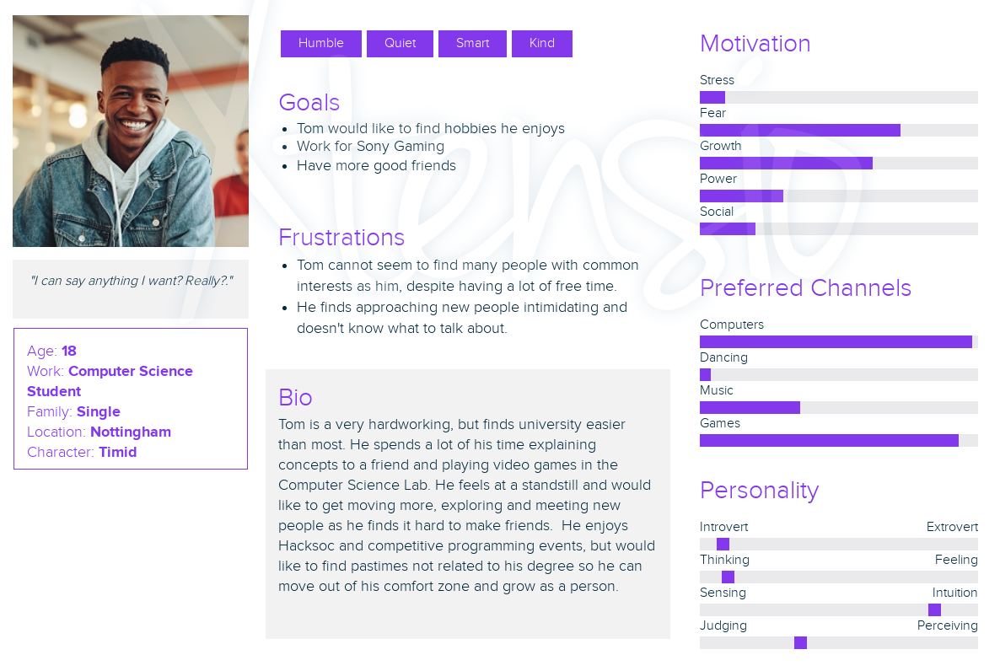

# Dance for Me - team 14

|Contents|
|--------|
|[Team Management](#team-management)|
|[Requirements](#requirements)|
|[Specification](#specification)|
|[Requirements Modelling](#requirements-modelling)|
|[Images and Examples of Dance for Me](#extras)|

## Team Management

**Commit message formatting:**  
&nbsp;&nbsp;<em>chore:</em> regular markdown or code maintenance 
&nbsp;&nbsp;<em>feat:</em> adding a new feature 
&nbsp;&nbsp;<em>fix:</em> bug fix 
&nbsp;&nbsp;<em>docs:</em> related to code documentation 
## Requirements 

| #   | Requirement | Type         | Description|
| ----| ----------- |--------------| -----------|
|  1  | System should accurately understand the pose of the user |Functional| Allows system to understand if the dance poses of the user meet the choreography|
| 2|System provides multiple choreographies to dance |  Functional| This allows the user a variety of dances to choose from with different difficulty levels|
| 3 | System is enticing and bring in users to start the game| Functional| Music, bright aesthetics and a friendly mascot are used to encourage users to play|
| 4 | System should give users a short tutorial| Functional | The mascot will speak conversationally to the user and tell them to perform certain poses
| 5 | System should provide a dance for the user | Functional | A dance will be presented and the system will interact with the user to judge their skills
| 6 | System contains high scores to be displayed | Non-Functional | A database will store top scores with photos to encourage competitive playing
| 7 | System should allow users to add new cheoreography into the system | Functional | Users are able to add to the dances

## Specification
| #   | Specification | Description| 
| ----| ----------- |--------------| 
| **1.1** | System shall acknowledge user presence| The system shall acknowledge the players’ presence by calibrating the users position and dimensions. The user will be prompted to strike a pose (e.g hand rise and nod) to initiate play| 
| 1.2 | System shall limit gameplay to 1 player at a time | To facilitate smooth gameplay, Mediapipe will lock on to one user and stops detecting as soon as the user has locked in|
| 1.3 | System shall react to players leaving | If at any point the user is unable to be detected, the system shall redirect to the pause screen and a prompt will be shown asking 'Continue?'. If a response is not given by the player, the system shall revert to 'Home Screen' after the 5 seconds count down.|
| **2.1** | The system shall provide 3 choregraphies to choose from | System should present user with 3 separate choreographies to choose from after play has been initiated: Beginner, Intermediate, and Advanced, and the choice will lead immediately into the dance.|
| 2.2 | The system will play the relevant background | A video with audio shall play for the background of each dance that will differ in colour scheme, animation and music. This is independent of user interactions.|
| 2.3 | The system should provide provide real time feedback on users dance moves| As the player is playing the game, the system will provide real time feedback by analyzing and comparing the prerecorded test data (avatars dance) and the players dance. The system will give a higher score for poses closest to the test data.|
| **3.1** | The system should play audio | The system will play catchy music that can be toggled off in game | 
| 3.2 | The system should have a mascot to attract passers-by | The mascot will appear to dance and wave in a seamless loop while in idle phase in order to attract the passers-by. The loop will end when the system detects the passers-by.|
| 3.3 | The system and mascot will interact with the passers-by | The mascot will call out to passerbys acting as a simple AI and engage players in playful conversation.|
| **4.1** | The system should give users a short tutorial | The mascot will give a short tutorial to the user in a snarky conversational manner.  |
| 4.2 | The system should show how close users dance is to the expected poses | The system will have the mascot dancing alongside with the player. This can show how close the user's dance move are to the expected poses. If the player is able to perform a dance move perfectly, a voice line of "YEAHH!" will be played to indicate the accuracy. **Note: We need to go over this requirement, we contradict ourselves a little bit later, how will the dance screen look?**|
| **5.1** | The system should play the video of the pre-filmed dance during the game | The system will retreive a pre-filmed dance made by developers from the database and play it on the screen. This should be shown alongside an outline of the user's position so the user can compare how accurate he/she is.|
| 5.2 | The system should show the next dance move | The system must show the player the next move at the appropriate time in a small box at the bottom right to ensure the player has enough time to prepare.|
| **6.1** | The system should send the score to the database | When game has ended, player name and score will be sent to the database.|
| 6.2 | The system should display a scoreboard | After the game has ended, the system will retreive the highest score from the database and display it.|
| 6.3 | The system should send the player's picture to the database | After the game has ended, the system should take a picture of the player and store it in the database. When the scoreboard is being displayed, the picture will be shown alongside the score.
| 6.4 | The system should not store the score of an unfinished attempt at the game| If the player was to leave before the end of the game, the system will pause for 10 seconds and return to the idle page if there isn't a response. The score should not be stored in the database.
| **7.1** | The system should store new choreography | The system should store the new choreography being added by software engineers and users in the database so it can be retreived when it is 
| 7.2 | The system will train the new choreography | The system should train the new choreography with Mediapipe in order to establish the scoring system.

## Requirements Modelling
#### Personas

Default Text

#### Use Case Diagram

 Default Text
 

#### Activity Diagram

Default Text

#### Sequence Diagram

Default Text

#### State Diagram w/ description

#### Low Fidelity Prototype

Default Text

## Extras

